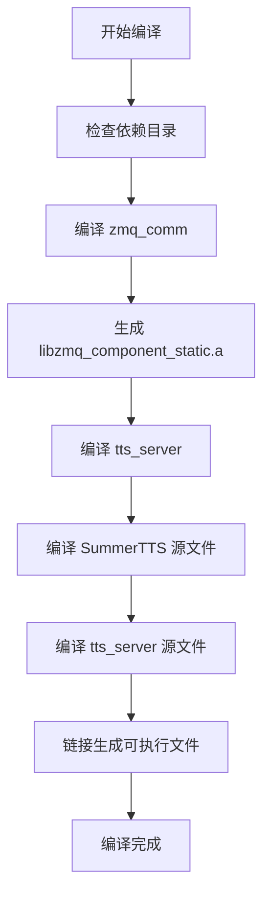

# TTS Server 分离改造总结

## 改造目标

将 tts_server 从 SummerTTS 项目中分离，使其能够独立编译和运行，同时保持与 SummerTTS 核心代码的引用关系而不是复制。

## 主要改动

### 1. 新增文件

#### 1.1 CMakeLists.txt (`/home/pi/RAG_System/tts_server/CMakeLists.txt`)
- 创建独立的 CMake 配置文件
- 引用 SummerTTS 源文件路径
- 配置所有必要的包含目录
- 链接静态 zmq_comm 库和其他依赖

#### 1.2 build.sh (`/home/pi/RAG_System/tts_server/build.sh`)
- 自动化编译脚本
- 先编译 zmq_comm，再编译 tts_server
- 包含错误检查和友好的输出信息

#### 1.3 run.sh (`/home/pi/RAG_System/tts_server/run.sh`)
- 运行脚本，简化启动流程
- 支持默认模型路径配置
- 包含参数检查

#### 1.4 README.md (`/home/pi/RAG_System/tts_server/README.md`)
- 详细的使用文档
- 编译说明
- 运行说明
- 故障排除指南

### 2. 修改的文件

#### 2.1 tts_server 头文件

**文件: `/home/pi/RAG_System/tts_server/include/Utils.h`**
```cpp
// 添加
#include <cstdint>
```

**文件: `/home/pi/RAG_System/tts_server/include/MessageQueue.h`**
```cpp
// 添加
#include <string>
```

#### 2.2 tts_server 源文件

**文件: `/home/pi/RAG_System/tts_server/src/Utils.cpp`**
```cpp
// 添加
#include <cstdint>
#include <sched.h>
#include <errno.h>
```

**文件: `/home/pi/RAG_System/tts_server/src/TextProcessor.cpp`**
```cpp
// 添加
#include <cstdint>
```

#### 2.3 SummerTTS 头文件（必要的修复）

**文件: `/home/pi/RAG_System/SummerTTS/src/header/Hanz2Piny.h`**
```cpp
// 添加
#include <cstdint>
```

**文件: `/home/pi/RAG_System/SummerTTS/src/header/pinyinmap.h`**
```cpp
// 添加
#include <cstdint>
```

**文件: `/home/pi/RAG_System/SummerTTS/src/header/hanzi2phoneid.h`**
```cpp
// 添加
#include <cstdint>
```

#### 2.4 zmq_comm 配置

**文件: `/home/pi/RAG_System/zmq_comm/CMakeLists.txt`**
```cmake
# 添加静态库生成
add_library(zmq_component_static STATIC
    src/ZmqInterface.cpp
    src/ZmqServer.cpp
    src/ZmqClient.cpp
)

target_link_libraries(zmq_component_static
    zmq
    Threads::Threads
)

# 修改安装目标
install(TARGETS zmq_component zmq_component_static DESTINATION lib)
```

### 3. 编译配置改动

#### 3.1 C++ 标准升级
- 从 C++11 升级到 C++14
- 原因: 支持 `std::make_unique`

#### 3.2 链接方式
- zmq_comm: 改用静态链接 (`libzmq_component_static.a`)
- 其他库保持动态链接

### 4. 目录结构

```
RAG_System/
├── SummerTTS/                 # TTS 核心实现
│   ├── include/              # 公共头文件
│   ├── src/                  # 源代码
│   │   ├── header/          # 内部头文件（已修复）
│   │   ├── models/          # 模型实现
│   │   ├── modules/         # 模块实现
│   │   ├── nn_op/           # 神经网络操作
│   │   ├── tn/              # 文本规范化
│   │   └── ...
│   └── eigen-3.4.0/         # Eigen 库
│
├── zmq_comm/                  # ZMQ 通信组件（已修改）
│   ├── include/
│   ├── src/
│   ├── build/               # 编译输出（包含静态库）
│   └── CMakeLists.txt       # 已修改
│
└── tts_server/                # TTS 服务器（独立）
    ├── include/              # 头文件（已修复）
    ├── src/                  # 源文件（已修复）
    ├── build/                # 编译输出
    │   └── tts_server       # 可执行文件
    ├── CMakeLists.txt        # 新增
    ├── build.sh              # 新增
    ├── run.sh                # 新增
    └── README.md             # 新增
```

## 技术细节

### 依赖关系

```
tts_server
├── 依赖 SummerTTS（引用源文件）
│   ├── 所有 src/ 下的 .cpp 文件
│   ├── include/ 下的头文件
│   ├── src/header/ 下的头文件
│   └── eigen-3.4.0/ 库
│
├── 依赖 zmq_comm（静态链接）
│   ├── libzmq_component_static.a
│   └── include/ 下的头文件
│
└── 外部依赖
    ├── libzmq
    ├── portaudio
    ├── asound (ALSA)
    └── pthread
```

### 编译流程



## 使用方法

### 编译

```bash
cd /home/pi/RAG_System/tts_server
./build.sh
```

### 运行

```bash
./build/tts_server <model_path>
```

或使用运行脚本：

```bash
./run.sh /path/to/model.bin
```

## 改造优势

1. **独立性**: tts_server 可以独立编译和运行
2. **解耦**: 不直接修改 SummerTTS 核心代码（除必要的头文件修复）
3. **可维护性**: 通过引用而非复制，便于 SummerTTS 更新
4. **清晰性**: 独立的 CMake 配置和构建脚本
5. **文档完善**: 详细的 README 和使用说明

## 注意事项

1. **SummerTTS 头文件修复**: 虽然尽量避免修改 SummerTTS，但为了编译通过，必须在几个头文件中添加 `#include <cstdint>`
2. **路径依赖**: 项目依赖固定的目录结构，移动时需要注意
3. **C++14**: 需要编译器支持 C++14 标准

## 测试验证

编译成功后的验证：

```bash
# 检查可执行文件
ls -lh /home/pi/RAG_System/tts_server/build/tts_server

# 查看文件信息
file /home/pi/RAG_System/tts_server/build/tts_server

# 输出应该类似:
# -rwxrwxr-x 1 pi pi 18M ... tts_server
# tts_server: ELF 64-bit LSB pie executable, ARM aarch64, ...
```

## 改造完成

✅ 所有目标已完成
✅ tts_server 可以独立编译
✅ 与 SummerTTS 保持引用关系
✅ 提供完整的文档和脚本
